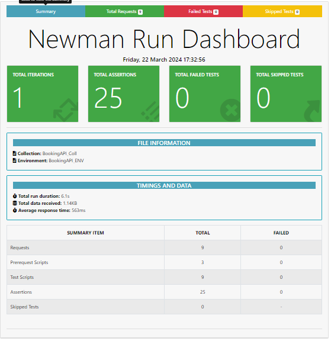
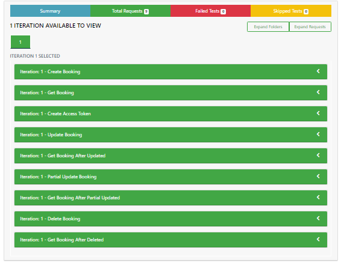
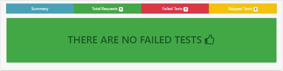
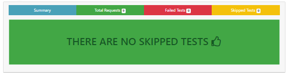

## REST Booking API Automation-Testing with Postman & Newman

The purpose of this project is to use Postman and Newman to automate the testing of a REST booking API. I enable consistent and dependable validation of the API endpoints by automating the testing process, which minimizes manual labor and allows for quicker feedback on modifications.

### Features
---
- Tested the diverse <span style="color: black; font-weight: bold;">HTTP</span> methods including <span style="color: green; font-weight: bold;">GET</span>, <span style="color: yellow; font-weight: bold;">POST</span>, <span style="color: skyblue; font-weight: bold;">PUT</span>, <span style="color: purple; font-weight: bold;">PATCH</span>, and <span style="color: crimson; font-weight: bold;">DELETE</span>.
- Collection of tests covering with different API endpoints.
- Environment setup for easy switching between environments.
- Pre-request scripts for data setup.
- Test scripts for assertions and validations.

### API Documentation
---
- `Documentation Link :` [API Documentation - Click here to open documentation](https://documenter.getpostman.com/view/29174005/2sA35A95nd)

### Tools and Technologies
---
- Postman
- Newman
- JavaScript
- JSON

### Prerequisite
---
- Node.Js
- Newman
- Newman HTML Reporter Library

### Installation
---
1. `Node.Js :` [Download and Install Node.js on your machine from here](https://nodejs.org/en/download)
2. `Postman :` [Download and Install Postman on your machine from here](https://www.postman.com/downloads/)
3. `Clone This Repository :` 
```console
git clone https://github.com/Muhammed-Nayeem/Automated-Testing-Of_Rest-Booking_API.git
```
4. `Import the Postman Collection :`  

    - Open Postman.
    - Click on the Import button.
    - Select the file from the repository.

5. `Import the Postman environment :`  

    - In Postman, click on the gear icon in the top right corner.
    - Select Import and choose the file.

6. `Newman and Report Installation Process :`  

    - Newman Install Command
    ```console
    npm install -g newman
    ```
    - Newman Html Report Install Command
    ```console
    npm install -g newman-reporter-htmlextra
    ```

### Usage
---
- `Select Environment :`

    - In Postman, select the appropriate environment (e.g., Development, Production) from the top-right dropdown.

- `Run Collection :`
    
    - Select the imported collection from the Collections sidebar.
    - Click on the Runner button to open the collection runner.
    - Select the desired environment.
    - Click Start Test to run the collection.

- `View Results :`

    - Once the tests are complete, view the results in the Runner tab.
    - Detailed test results can be viewed for each request.

### Testing and Test Case Scenarios
---
1. **Create Booking**   
    - `Request URL :` https://restful-booker.herokuapp.com/booking/
    - `Request Method :` <span style="color: yellow; font-weight: bold;">POST</span>
    - **Pre-request Script :**
    ```js
      //Prepared Predefined random Data Set:
      let firstName = pm.variables.replaceIn("{{$randomFirstName}}");
      let lastName = pm.variables.replaceIn("{{$randomLastName}}");
      let totalPrice = pm.variables.replaceIn("{{$randomPrice}}");
      let depositPaid = pm.variables.replaceIn("{{$randomBoolean}}");
      let additionalNeeds = pm.variables.replaceIn("{{$randomProductName}}");

      //Date:
      const date = require("moment");
      const today = date();
      let checkIn = today.add(3, "d").format("YYYY-MM-DD");
      let checkOut = today.add(4, "d").format("YYYY-MM-DD");

      //Store Variables in Environment:
      pm.environment.set("firstName", firstName);
      pm.environment.set("lastName", lastName);
      pm.environment.set("totalPrice", parseInt(totalPrice));
      pm.environment.set("depositPaid", depositPaid);
      pm.environment.set("checkIn", checkIn);
      pm.environment.set("checkOut", checkOut);
      pm.environment.set("additionalNeeds", additionalNeeds);
    ```  
    - **Request Body :**
    ```json
      {
        "firstname": "{{firstName}}",
        "lastname": "{{lastName}}",
        "totalprice": {{totalPrice}},
        "depositpaid": {{depositPaid}},
        "bookingdates": {
            "checkin": "{{checkIn}}",
            "checkout": "{{checkOut}}"
        },
        "additionalneeds": "{{additionalNeeds}}"
      }
    ```  
    - **Tests :**
    ```js
      //Get the response code:
      let responseStatusCode = pm.response.code;

      //If the response code is 200, then do the certian task:
      switch(responseStatusCode) {
        case 200:
          let responseData = pm.response.json();
          pm.environment.set("bookingId", responseData.bookingid);
          pm.test(`Veryfying that Booking Creation is successfull of id-${pm.environment.get("bookingId")}`);
          break;
      
        default:
          pm.test(`Booking Dosen't Created Successfully!`);
      }
    ```
    - **Response Body :**
    ```json
      {
        "bookingid": 804,
        "booking": {
          "firstname": "Kennedy",
          "lastname": "Wolf",
          "totalprice": 798,
          "depositpaid": false,
          "bookingdates": {
              "checkin": "2024-03-26",
              "checkout": "2024-03-30"
          },
          "additionalneeds": "Licensed Soft Hat"
        }
      }
    ```  

2. **Read After Create Booking :**
    
    - `Request URL :` https://restful-booker.herokuapp.com/booking/{{bookingid}}
    - `Request Method :` <span style="color: green; font-weight: bold;">GET</span>
    - `Pre-request Script :` N/A
    - `Request Body :` N/A
    - **Tests :**
    ```js
      /**
      * Title: Test Script For Data Cross Validation;
      */

      let responseStatusCode = pm.response.code;

      switch(responseStatusCode) {
        case 200:
          let responseData = pm.response.json();
          pm.test(`Checking Get Booking Data of id-${pm.environment.get("bookingId")}'s Ok!`);

          pm.test("Checking if the First Name is inserted as the given input", function() {
              pm.expect(pm.environment.get("firstName")).to.eql(responseData.firstname);
          });

          pm.test("Checking if the Last Name is inserted as the given input", function() {
              pm.expect(pm.environment.get("lastName")).to.eql(responseData.lastname);
          });

          pm.test("Checking if the Total Price is inserted as the given input", function() {
              pm.expect(pm.environment.get("totalPrice")).to.eql(responseData.totalprice);
          });

          pm.test("Checking if the Deposit Paid is inserted as the given input", function() {
              pm.expect(pm.environment.get("depositPaid")).to.eql(responseData.depositpaid.toString());
          });

          pm.test("Checking if the Checkin Date is inserted as the given input", function() {
              pm.expect(pm.environment.get("checkIn")).to.eql(responseData.bookingdates.checkin);
          });

          pm.test("Checking if the Checkout Date is inserted as the given input", function() {
              pm.expect(pm.environment.get("checkOut")).to.eql(responseData.bookingdates.checkout);
          });

          pm.test("Checking if the AdditionalNeeds is inserted as the given input", function() {
              pm.expect(pm.environment.get("additionalNeeds")).to.eql(responseData.additionalneeds);
          });
          break;

        case 500:
          pm.test(`Server Error of id-${pm.environment.get("bookingId")}'s record!`);
          break;

        case 404:
          pm.test(`Not Found Any Record of id-${pm.environment.get("bookingId")}`);
          break;

        default:
          pm.test(`Geting Trouble To Fetch Data of id-${pm.environment.get("bookingId")}`);
      }
    ```
    - **Response Body :**
    ```json
      {
        "firstname": "Kennedy",
        "lastname": "Wolf",
        "totalprice": 798,
        "depositpaid": false,
        "bookingdates": {
            "checkin": "2024-03-26",
            "checkout": "2024-03-30"
        },
        "additionalneeds": "Licensed Soft Hat"
      }
    ```
3. **Create Access Token :**

    - `Request URL :` https://restful-booker.herokuapp.com/auth
    - `Request Method :` <span style="color: yellow; font-weight: bold;">POST</span>
    - `Pre-request Script :` N/A
    - **Request Body :**
    ```json
      {
      "username": "admin",
      "password": "password123"
      }
    ```
    - **Tests :**
    ```js
      //Get the response code:
      let responseStatusCode = pm.response.code;

      //If the response code is 200, then do the certain task:
      switch(responseStatusCode) {
        case 200:
            let responseData = pm.response.json();
            pm.environment.set("accessToken", responseData.token);
            pm.test("Checking if the Access Token is creating.");
            break;

        default:
            pm.test("Doesn't created Access Token Successfully!");
      }
    ```
    - **Response Body :**
    ```json
      {
        "token": "0ac1c17ed76846b"
      }
    ```
4. **Update A Booking :**

    - `Request URL :` https://restful-booker.herokuapp.com/booking/{{bookingid}}
    - `Request Method :` <span style="color: skyblue; font-weight: bold;">PUT</span>
    - **Pre-request Script :**
    ```js
      //Predefined Data Set:
      let updatedFirstName = pm.variables.replaceIn("{{$randomFirstName}}");
      let updatedLastName = pm.variables.replaceIn("{{$randomLastName}}");
      let updatedTotalPrice = pm.variables.replaceIn("{{$randomPrice}}");
      let updatedDepositPaid = pm.variables.replaceIn("{{$randomBoolean}}");
      let updatedAdditionalNeeds = pm.variables.replaceIn("{{$randomProductName}}");

      //Date:
      const date = require("moment");
      const today = date();
      let updatedCheckIn = today.add(2, "d").format("YYYY-MM-DD");
      let updatedCheckOut = today.add(4, "d").format("YYYY-MM-DD");

      //Store Variables in Environment:
      pm.environment.set("updatedFirstName", updatedFirstName);
      pm.environment.set("updatedLastName", updatedLastName);
      pm.environment.set("updatedTotalPrice", parseInt(updatedTotalPrice));
      pm.environment.set("updatedDepositPaid", updatedDepositPaid);
      pm.environment.set("updatedCheckIn", updatedCheckIn);
      pm.environment.set("updatedCheckOut", updatedCheckOut);
      pm.environment.set("updatedAdditionalNeeds", updatedAdditionalNeeds);
    ```
    - **Request Body :**
    ```json
      -H Key: Cookie, Value: token=0ac1c17ed76846b
      {
        "firstname": "{{updatedFirstName}}",
        "lastname": "{{updatedLastName}}",
        "totalprice": {{updatedTotalPrice}},
        "depositpaid": {{updatedDepositPaid}},
        "bookingdates": {
            "checkin": "{{updatedCheckIn}}",
            "checkout": "{{updatedCheckOut}}"
        },
        "additionalneeds": "{{updatedAdditionalNeeds}}"
      }
    ```
    - **Tests :**
    ```js
      /**
      * Title: Test Script For Data Update Validation;
      */

      let responseStatusCode = pm.response.code;

      switch(responseStatusCode) {
        case 200:
            pm.test(`Veryfying that Booking Data is update of id's-${pm.environment.get("bookingId")}!`);
            break;

        case 403:
            pm.test(`Dosen't modified to Details of Booking ID- ${pm.environment.get("bookingId")}`);
            break;

        case 405:
            pm.test(`There's No Details of Booking ID- ${pm.environment.get("bookingId")} - Create First`);
            break;

        default:
            pm.test("Not Allowed to Update/Delete!");
      }
    ```
    - **Response Body :**
    ```json
      {
        "firstname": "Nicolas",
        "lastname": "Bode",
        "totalprice": 238,
        "depositpaid": false,
        "bookingdates": {
            "checkin": "2024-03-25",
            "checkout": "2024-03-29"
        },
        "additionalneeds": "Tasty Frozen Computer"
      }
    ```
5. **Read After Update A Booking :**

    - `Request URL :` https://restful-booker.herokuapp.com/booking/{{bookingid}}
    - `Request Method :` <span style="color: green; font-weight: bold;">GET</span>
    - `Pre-request Script :` N/A
    - `Request Body :` N/A
    - **Tests :**
    ```js
      /**
      * Title: Test Script For Updated Data Cross Validation;
      */

      let responseStatusCode = pm.response.code;

      switch(responseStatusCode) {
        case 200:
          let responseData = pm.response.json();
          pm.test(`Checking if the Get Booking Data is updated of id's-${pm.environment.get("bookingId")} after update!`);

          pm.test("Checking if the Updated First Name as provided.", function() {
              pm.expect(pm.environment.get("updatedFirstName")).to.eql(responseData.firstname);
          });

          pm.test("Checking if the Updated Last Name as provided.", function() {
              pm.expect(pm.environment.get("updatedLastName")).to.eql(responseData.lastname);
          });

          pm.test("Checking if the Updated Total Price as provided.", function() {
              pm.expect(pm.environment.get("updatedTotalPrice")).to.eql(responseData.totalprice);
          });

          pm.test("Checking if the Updated Deposit Paid as provided.", function() {
              pm.expect(pm.environment.get("updatedDepositPaid")).to.eql(responseData.depositpaid.toString());
          });

          pm.test("Checking if the Updated Checkin Date as provided.", function() {
              pm.expect(pm.environment.get("updatedCheckIn")).to.eql(responseData.bookingdates.checkin);
          });

          pm.test("Checking if the Updated Checkout Date as provided.", function() {
              pm.expect(pm.environment.get("updatedCheckOut")).to.eql(responseData.bookingdates.checkout);
          });

          pm.test("Checking if the Updated AdditionalNeeds as provided.", function() {
              pm.expect(pm.environment.get("updatedAdditionalNeeds")).to.eql(responseData.additionalneeds);
          });
          break;

        case 500:
          pm.test(`Server Error of id-${pm.environment.get("bookingId")}'s record!`);
          break;

        case 404:
          pm.test(`Not Found Any Record of id-${pm.environment.get("bookingId")}`);
          break;

        default:
          pm.test(`Geting Trouble To Fetch Data of id-${pm.environment.get("bookingId")}`);
      }
    ```
    - **Response Body :**
    ```json
      {
        "firstname": "Nicolas",
        "lastname": "Bode",
        "totalprice": 238,
        "depositpaid": false,
        "bookingdates": {
            "checkin": "2024-03-25",
            "checkout": "2024-03-29"
        },
        "additionalneeds": "Tasty Frozen Computer"
      }
    ```
6. **Partially Update A Booking :**

    - `Request URL :` https://restful-booker.herokuapp.com/booking/{{bookingid}}
    - `Request Method :` <span style="color: purple; font-weight: bold;">PATCH</span>
    - **Pre-request Script :**
    ```js
      //Predefined Data Set:
      let partialUpdatedTotalPrice = pm.variables.replaceIn("{{$randomPrice}}");
      let partialUpdatedDepositPaid = pm.variables.replaceIn("{{$randomBoolean}}");

      //Store Variables in Environment:
      pm.environment.set("partialUpdatedTotalPrice", parseInt(partialUpdatedTotalPrice));
      pm.environment.set("partialUpdatedDepositPaid", partialUpdatedDepositPaid);
    ```
    - **Request Body :**
    ```json
      -H Key: Cookie, Value: token=0ac1c17ed76846b
      {
        "totalprice": {{partialUpdatedTotalPrice}},
        "depositpaid": {{partialUpdatedDepositPaid}}
      }
    ```
    - **Tests :**
    ```js
      //Get the response code:
      let responseStatusCode = pm.response.code;

      //if response code is 200, then do certain task:
      switch(responseStatusCode) {
        case 200:
          pm.test(`Veryfying that Booking Data is Partially update of id's-${pm.environment.get("bookingId")}`);
          break;

        case 403:
          pm.test(`Dosen't Partially Modified to Details of Booking ID- ${pm.environment.get("bookingId")}`);
          break;

        case 405:
          pm.test(`There's No Details of Booking ID- ${pm.environment.get("bookingId")} - Create First`);
          break;

        default:
          pm.test("Not Allowed to Update/Delete!");
      }
    ```
    - **Response Body :**
    ```json
      {
        "firstname": "Nicolas",
        "lastname": "Bode",
        "totalprice": 232,
        "depositpaid": false,
        "bookingdates": {
            "checkin": "2024-03-25",
            "checkout": "2024-03-29"
        },
        "additionalneeds": "Tasty Frozen Computer"
      }
    ```
7. **Read After Partially Update A Booking :**

    - `Request URL :` https://restful-booker.herokuapp.com/booking/bookingid
    - `Request Method :` <span style="color: green; font-weight: bold;">GET</span>
    - `Pre-request Script :` N/A
    - `Request Body :` N/A
    - **Tests :**
    ```js
      /**
      * Title: Test Script For Partial Updated Data Cross Validation;
      */

      let responseStatusCode = pm.response.code;

      switch(responseStatusCode) {
        case 200:
          let responseData = pm.response.json();
          pm.test(`Checking if the Booking id's-${pm.environment.get("bookingId")} data is partially updated.`);

          pm.test("Checking if the Total Price is Partially Updated as provided.", function() {
              pm.expect(pm.environment.get("partialUpdatedTotalPrice")).to.eql(responseData.totalprice);
          });

          pm.test("Checking if the Deposit Paid is Partially Updated as provided.", function() {
              pm.expect(pm.environment.get("partialUpdatedDepositPaid")).to.eql(responseData.depositpaid.toString());
          });
          break;

        case 500:
          pm.test(`Server Error of id-${pm.environment.get("bookingId")}'s record!`);
          break;

        case 404:
          pm.test(`Not Found Any Record of id-${pm.environment.get("bookingId")}`);
          break;

        default:
          pm.test(`Geting Trouble To Fetch Data of id-${pm.environment.get("bookingId")}`);
      }
    ```
    - **Response Body :**
    ```json
      {
        "firstname": "Nicolas",
        "lastname": "Bode",
        "totalprice": 232,
        "depositpaid": false,
        "bookingdates": {
            "checkin": "2024-03-25",
            "checkout": "2024-03-29"
        },
        "additionalneeds": "Tasty Frozen Computer"
      }
    ```
8. **Delete A Booking :**

    - `Request URL :` https://restful-booker.herokuapp.com/booking/{{bookingid}}
    - `Request Method :` <span style="color: crimson; font-weight: bold;">DELETE</span>
    - `Pre-request Script :` N/A
    - `Request Body :` N/A
    - **Header :**
    ```
      key: Cookie Value: token=d1702d49fdaf5e9
    ```
    - **Tests :**
    ```js
      //Get the response code:
      let responseStatusCode = pm.response.code;

      //If the response code is 200, then do the certain task:
      switch(responseStatusCode) {
        case 200:
          let responseData = pm.response.json();
          pm.environment.set("accessToken", responseData.token);
          pm.test("Checking if the Access Token is creating.");
          break;

        default:
          pm.test("Doesn't created Access Token Successfully!");
      }
    ```
    - **Response Body :**
    ```json
      Created -> Postman Problem
    ```
9. **Read After Deleted Booking :**

    - `Request URL :` https://restful-booker.herokuapp.com/booking/{{bookingid}}
    - `Request Method :` <span style="color: green; font-weight: bold;">GET</span>
    - `Pre-request Script :` N/A
    - `Request Body :` N/A
    - **Tests :**
    ```js
      //Response  Code:
      let responseStatusCode = pm.response.code;

      //if response code is 200, then do the certain task:
      switch(responseStatusCode) {
        case 500:
          pm.test(`Server Error of id-${pm.environment.get("bookingId")}'s record!`);
          break;

        case 404:
          pm.test(`Not Found Any Record of id-${pm.environment.get("bookingId")}. Deleted Successfully!`);
          break;

        default:
          pm.test(`Trouble to Fetch Data of id-${pm.environment.get("bookingId")}`);
      }
    ```
    - **Response Body :**
    ```json
      Not Found
    ```
### Run From CMD :
---
- Run Command For Console :
```console
  newman run BookingAPI_Coll.postman_collection.json -e BookingAPI_ENV.postman_environment.json
```
- Run Command For Report Generate :
```console
  newman run BookingAPI_Coll.postman_collection.json -e BookingAPI_ENV.postman_environment.json -r cli,htmlextra
```
### Newman Report Summary :
---




